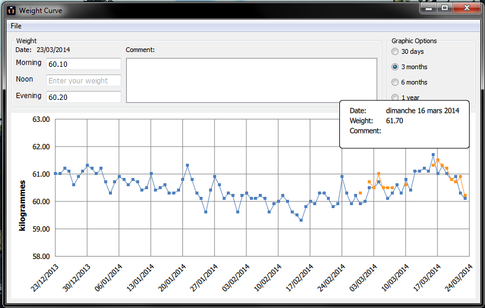

WeightCurve
===========

A small QML application showing your weight curve.

Features
--------

1. **3 curves**

    3 Curves can be displayed, one for morning, noon and evening.

2. **Popup on each plot**

    A popup is showed when your cursor is hover a plot, it remains precisely plot attributs.
    
3. **Comment per day**

    A comment can be added for each day, so feel free to enter what you eat or everything else.
    
4. **Select display range**

    You can choose the range of weights you want see.
    
Motivations
-----------

I made this application essentially to increase my experience with QML. This experience is important for my day job and for my personnal project DQuick (also on github).
